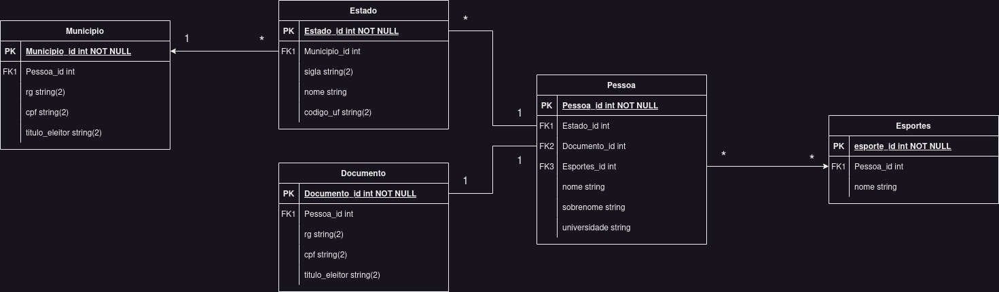

# Banco de dados usando ActiveRecord

## Autor

Vinícius Fontoura de Abreu

## Objetivo

Criar e usar um banco de dados utilizando ActiveRecord.

## Relação entre as Entidades

Temos as entidades `Pessoa`, `Estado`, `Municipio`, `Documento` e `Esporte`.
A relação entre as entidades pode ser vista o seguinte diagrama:



## Execução

### Criando e populando a base de dados

Para criar e popular a base de dados, execute o comando:

```bash
./criadb.sh
```

Este comando irá criar o banco de dados `db.sqlite3` e popular as tabelas com dados de exemplo presentes no diretório [csv](./csv/).

### Executando o programa

A partir do executável `orm.sh` é possível executar as seguintes operações:

- `lista`: Lista todas as entradas de uma tabela
- `cria`: Adiciona uma nova entrada em uma tabela
- `deleta`: Remove uma entrada de uma tabela
- `altera`: Atualiza uma entrada de uma tabela

As tabelas disponíveis são:

- `pessoas`
- `estados`
- `municipios`
- `documentos`
- `esportes`

Para conferir a ajuda de uma tabela, execute:

```bash
./orm.sh help pessoas
```

### Exemplos

Para **listar** todas as pessoas, execute:

```bash
./orm.sh lista pessoas
```

Para **adicionar** uma nova pessoa, execute:

```bash
./orm.sh cria pessoas nome=joao sobrenome=silva universidade=UFPR estado=PR rg=213124512 cpf=12341241 titulo_eleitor=124124124 esportes=vôlei,handebol
```

Para **remover** um esporte, execute:

```bash
./orm.sh deleta esportes id=1
```

não deixe de conferir se alguém que fazia esse esporte deixou de tê-lo agora :)

Para **atualizar** um estado, execute:

```bash
./orm.sh altera estados id=1 nome=Paraná sigla=RP
```

### Conferindo a atualização das relações

Vamos executar algumas operaçõs e consultas para verificar se as relações estão funcionando corretamente.

1. Adicione um novo município ao estado do Paraná:

```bash
./orm.sh cria municipios nome=DINF estado=PR
```

2. Adicione um novo documento para a pessoa Bruno Mûller:

```bash
./orm.sh cria documentos rg=123456 cpf=123456789 titulo_eleitor=1234567890 id=2
```

3. Adicione um novo esporte para a pessoa Bruno Mûller:

```bash
./orm.sh altera pessoas esportes=Basquete,judô id=2
```

4. Remova um Estado e verifique se os municípios associados a ele foram removidos:

```bash
./orm.sh deleta estados id=2
```

5. Remova uma pessoa e verifique se os documentos associados a ela foram removidos:

```bash
./orm.sh deleta pessoas id=1
```

## Dificuldades

Existe um erro que parece acontecer por declarar `has_and_belongs_to_many` em mais de uma entidade. Não consegui descobrir exatamente o motivo. Isso faz com que depois de todo comando, o programa exibe um warning mas funciona normalmente.

O warning é algo como:

```text
warning: already initialized constant Pessoa::HABTM_Esportes
warning: previous definition of HABTM_Esportes was here
```
